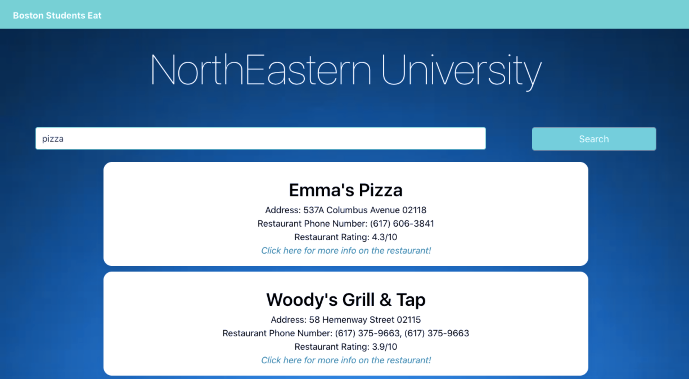
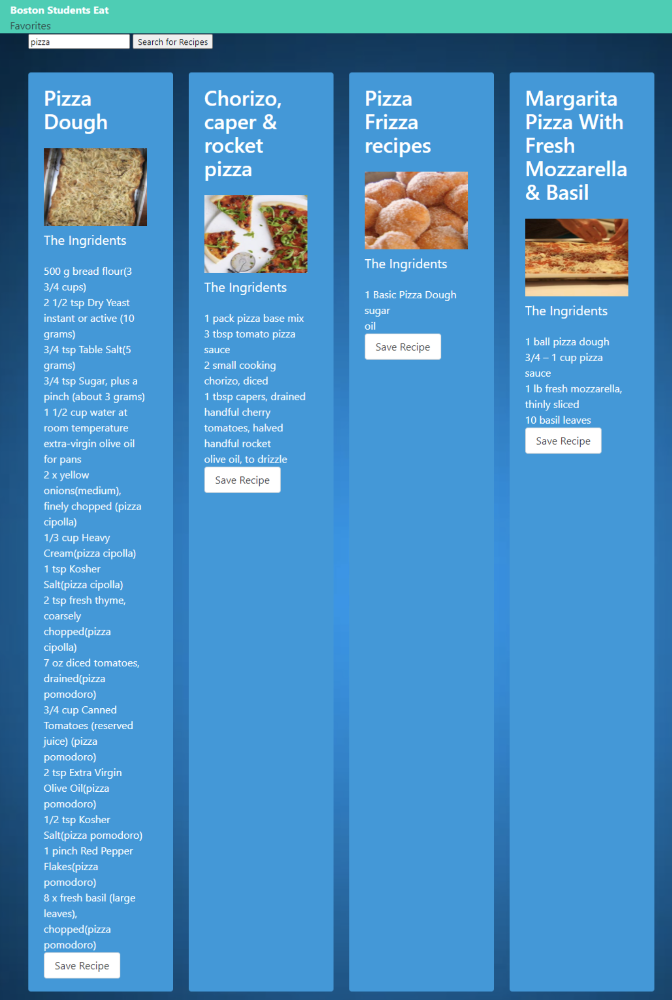

## Boston Students Eat ##
Take out or Cooking for yourself? This application will help you find a top-rated value restaurant within a 10-mile radius of Boston College, Harvard College, MIT, and Northeastern University. As, well as a variety of delicious recipes. 

## Motivation ##
We are Boston Studetns here to help take the guessing out of your next meal with an easy guide to local restaurants and delicious recipes. 

## This project has the following features: ##
A home page with two buttons, the "cooking for yourself" button will lead you to another page where you can search for a variety of recipes. Just search for any food you want, and the recipes will pop up. You can also hit the save button to save your favorite recipes for later. Or if you don't feel like cooking? Click on the "taking out" button, and pick your school. Then search for any food you want and choose from a variety of restaurants within your area.  

## Framework Used ##
* Bulma 
* Materialize

## API Reference ##
* ZomAPI
* SpoonAPI

## Screen Shots ## 

## Power Point ##
[Boston Students Eat](https://docs.google.com/presentation/d/1vDWEN2YIOpiKR0CxQk8N8AFlgB7WQkJ0aCHdCfK8t9s/edit?usp=sharing)

## Credits ##
* Lindsey Bowen - Home page utilized “Materialize” website and css for customization
* Margaret Elson - Back End of the “Take Out” Page, Zomato API.
* Nicholas Jazgunovich - Back End of “Cooking for Yourself” page, Spoonacular API, and favorite recipes page. 
* Matt Vanni - HTML pages branching off of the home page utilized “Bulma” website and css for customization, and framework prototype for deployed website 

